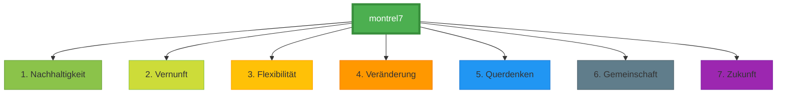

## Hi there 👋

# Montrel: 7 Layer für eine moderne Zukunft

Wir denken nicht in Grenzen, sondern in **Layers** – wie das OSI-Modell, das die digitale Welt strukturiert. **7 Ebenen**, die zusammenarbeiten, um Verbundenheit zu schaffen.

Genauso bauen wir bei **Montrel** Lösungen auf:
1. **Nachhaltigkeit** als Fundament.
2. **Vernunft** als Leitfaden.
3. **Flexibilität** als Werkzeug.
4. **Veränderung** als Antrieb.
5. **Querdenken** als Methode.
6. **Gemeinschaft** als Ziel.
7. **Zukunft** als Ergebnis.

**Montrel** steht für diese **7 Prinzipien** – klar, technisch, menschlich.

---

## Visualisierung

graph TD
    A[montrel7] --> B[1. Nachhaltigkeit]
    A --> C[2. Vernunft]
    A --> D[3. Flexibilität]
    A --> E[4. Veränderung]
    A --> F[5. Querdenken]
    A --> G[6. Gemeinschaft]
    A --> H[7. Zukunft]
    
    style A fill:#4CAF50,stroke:#388E3C,stroke-width:4px,color:#fff
    style B fill:#8BC34A,stroke:#689F38
    style C fill:#CDDC39,stroke:#8BC34A
    style D fill:#FFC107,stroke:#FFA000
    style E fill:#FF9800,stroke:#F57C00
    style F fill:#2196F3,stroke:#1976D2
    style G fill:#607D8B,stroke:#455A64
    style H fill:#9C27B0,stroke:#7B1FA2
